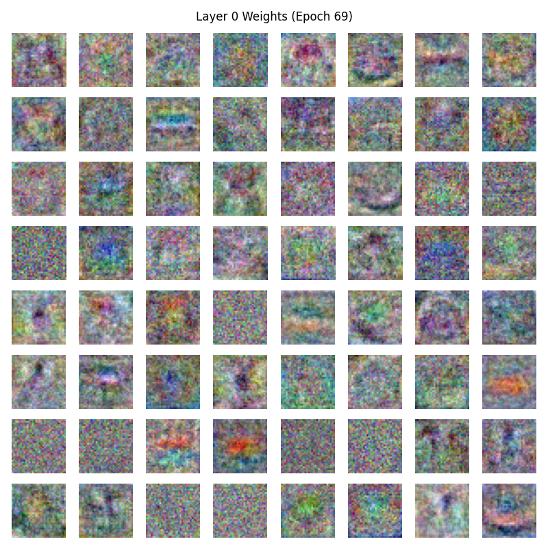

# 实验报告：从零开始构建三层神经网络分类器

## 1. 实验简介

### 1.1 实验目的
- 手工搭建三层神经网络分类器，训练并测试其在 CIFAR-10 数据集上的性能。

### 1.2 数据集简介
- 数据集：CIFAR-10
- 数据描述：包含 10 个类别的彩色图像，每张图像大小为 32x32，共计 60000 张图像，其中训练集 50000 张，测试集 10000 张。

---

## 2. 模型设计
### 2.1 基本组成
- **输入层**：接收 CIFAR-10 数据集的图像输入，每张图像大小为 32x32x3，输入层的维度为 3072。
- **隐藏层**：包含两层全连接层（Linear），每层后接一个激活函数（支持 ReLU、Sigmoid 或 Tanh）。支持自定义大小，默认隐藏层的维度为 512。
- **输出层**：最后一层为全连接层，输出维度为 10，对应 CIFAR-10 的 10 个类别。
- **激活函数**：支持 ReLU、Sigmoid 和 Tanh，可指定激活函数类型，默认为 ReLU。
- **Softmax 层**：在前向传播的最后，使用 Softmax 函数将输出转换为概率分布，用于分类任务。
- **损失函数**：交叉熵损失。

### 2.2 模型结构
1. 第一层：全连接层（Linear），输入维度为 3072，输出维度为隐藏层大小（默认 512）。
2. 第二层：激活函数层（ReLU/Sigmoid/Tanh）。
3. 第三层：全连接层（Linear），输入维度为隐藏层大小（默认 512），输出维度为隐藏层大小（默认 512）。
4. 第四层：激活函数层（ReLU/Sigmoid/Tanh）。
5. 第五层：全连接层（Linear），输入维度为隐藏层大小（默认 512），输出维度为 10。

### 2.3 前向传播
前向传播过程中，输入数据依次通过每一层：
1. 数据首先通过全连接层（Linear），计算线性变换。
2. 然后通过激活函数层（如 ReLU），引入非线性特性。

$$y = xW + b$$

输入：x 是形状为 $(N, D_{in})$ 的输入矩阵，其中 (N) 是批量大小，$(D_{in})$ 是输入特征维度。

权重：W 是形状为 $(D_{in}, D_{out})$ 的权重矩阵。

偏置：b 是形状为 $(D_{out},)$ 的偏置向量。

输出：y 是形状为 $(N, D_{out})$ 的输出矩阵。

### 2.4 反向传播
反向传播过程中，通过链式法则计算损失函数对每一层参数的梯度：
1. 从输出层开始，计算损失对输出的梯度。
2. 依次向前传播梯度，更新每一层的权重和偏置。

权重梯度： $\frac{\partial L}{\partial W} = x^T \cdot grad_\text{out}$ 

其中，$\grad_\text{output}$ 是损失对输出 y 的梯度，形状为 $(N, D_{out})$。

偏置梯度： $\frac{\partial L}{\partial b} = \sum_{i=1}^N grad_\text{out}[i]$

输入梯度： $\frac{\partial L}{\partial x} = grad_\text{out} \cdot W^T$

### 2.5 优化器
- 使用随机梯度下降（SGD）。
- 支持学习率衰减。
- 包含 L2 正则化以防止过拟合。

---

## 3. 实验过程

### 3.1 数据预处理
- 图像像素值归一化到 [0, 1]。
- 划分训练集、验证集，验证集大小为 5000。

### 3.2 超参数设置

模型超参数：
- 隐藏层大小：512

训练超参数：
- 初始学习率：0.03
- 学习率衰减系数：0.98
- L2 正则化强度：0.0001
- 批量大小：128
- 训练轮数：100

### 3.3 训练过程
- 在训练集上进行前向传播和反向传播，更新权重。
- 每轮训练后在验证集上评估模型性能，保存验证集准确率最高的模型权重。

### 3.4 测试过程
- 加载保存的最优模型权重，在测试集上评估分类准确率。

---

## 4. 实验结果

### 4.1 性能指标
- 测试集分类准确率：**0.5176**。
- 测试集损失：**1.5566**。

### 4.2 可视化结果
#### 4.2.1 训练过程曲线
**训练集 Loss 曲线**  
**验证集 Loss 曲线**  
**验证集 Accuracy 曲线**  

#### 4.2.2 模型权重可视化
**隐藏层权重可视化**  
每 10 个 epoch 可视化一次全连接层 Layer 0 的前 64 个神经元的权重

---

## 5. 附录

### 5.1 实验代码
- [GitHub Repo 链接](https://github.com/meowmori/nn-dl-course-hw1/tree/main)

### 5.2 模型权重
- [模型权重](https://github.com/meowmori/nn-dl-course-hw1/blob/main/experiments/exp_20250401_061413/best_model.npy)
